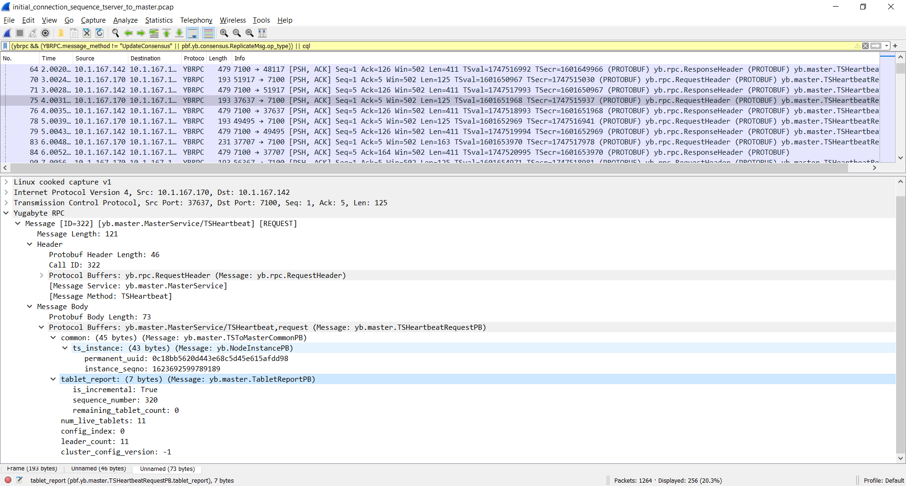
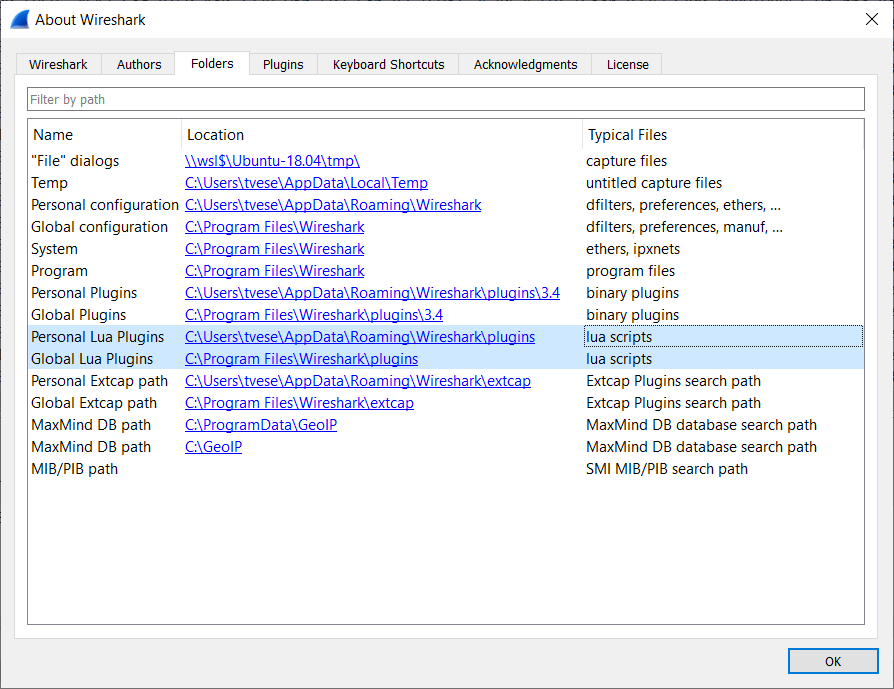
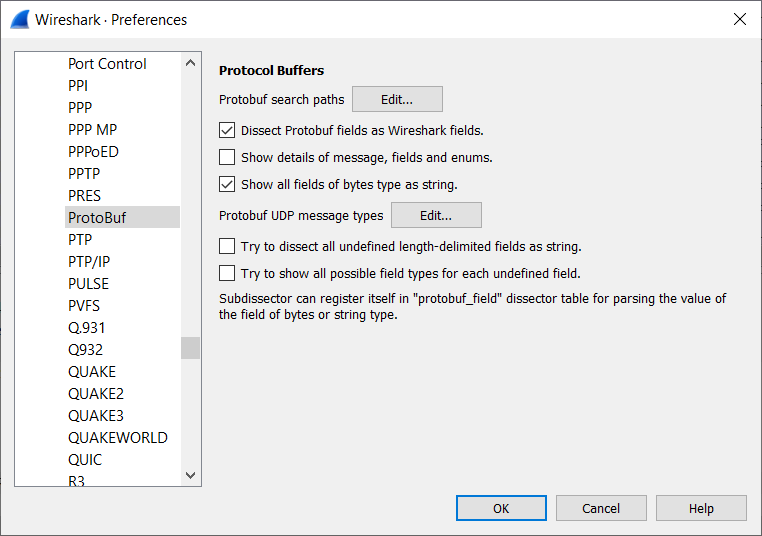
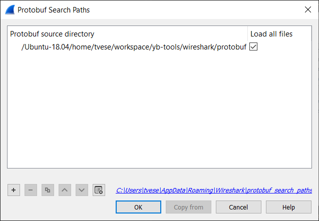

# Yugabyte wireshark plugins

## ybrpc.lua
`plugins/ybrpc.lua` is a wireshark dissector for Yugabyte RPC traffic

### Usage

Place the `ybrpc.lua` script in either your `Personal Lua Plugins`, or `Global Lua Plugins` Directory. These paths can be found in the ` Help -> About wireshark -> Folders` menu.

Enable the following settings in the `Edit -> Preferences -> Protocols -> ProtoBuf` dialog:

In `Edit -> Preferences -> Protocols -> ProtoBuf -> Protobuf search paths` point your `Protobuf source directory` to the protobuf directory in this repository.

Open a wireshark capture of the Yugabyte database to see the protocol dissection
